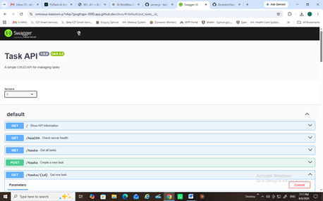

# Task API

A simple CRUD API built with Node.js, Express, and SQLite for managing a to-do list.

This project is a continuation of my previous **Task API assignment**.

The previous version was completed as **Assignment 1 / Task 1**, where tasks were stored temporarily in an in-memory JavaScript array.

This version is **Week 3 — Assignment 1: Connecting CRUD to the Database**.

The API endpoints and request/response structure remain the same, but the storage layer has been upgraded from in-memory storage to a real SQLite database.

## Features

* Create a task
* View all tasks
* View one task by ID
* Update a task
* Delete a task
* Input validation
* Correct HTTP status codes
* Swagger UI documentation
* SQLite database storage
* Persistent data after server restarts
* Automatic database and table creation
* Three example tasks added only when the database is empty

## Technologies

* Node.js
* Express.js
* SQLite
* better-sqlite3
* Swagger UI
* Git and GitHub

## Why SQLite?

SQLite was chosen because it is lightweight, simple to use, and does not require a separate database server.

It stores the entire database in a single file, which makes it suitable for a small project like this.

The database file is:

```text
tasks.db
```

It is stored in the root folder of the project.

## How to install and run

Install the project dependencies:

```bash
npm install
```

Start the server:

```bash
node server.js
```

The API will run at:

```text
http://localhost:3000
```

Swagger UI will be available at:

```text
http://localhost:3000/docs
```

When the application starts, it automatically creates the SQLite database and the `tasks` table if they do not already exist.

If the table is empty, three example tasks are inserted automatically.

## Database Structure

The SQLite database contains a table called:

```text
tasks
```

The table contains the following columns:

| Column  | Type              | Description                         |
| ------- | ----------------- | ----------------------------------- |
| `id`    | INTEGER           | Primary key for each task           |
| `title` | TEXT              | Task title                          |
| `done`  | INTEGER / Boolean | Shows whether the task is completed |

## Endpoints

| Method | Endpoint     | Description          |
| ------ | ------------ | -------------------- |
| GET    | `/`          | Show API information |
| GET    | `/health`    | Check server health  |
| GET    | `/tasks`     | Get all tasks        |
| GET    | `/tasks/:id` | Get one task         |
| POST   | `/tasks`     | Create a task        |
| PUT    | `/tasks/:id` | Update a task        |
| DELETE | `/tasks/:id` | Delete a task        |

## Example POST Request

```bash
curl -i -X POST http://localhost:3000/tasks \
-H "Content-Type: application/json" \
-d '{"title":"Buy milk"}'
```

Example response:

```text
HTTP/1.1 201 Created
Content-Type: application/json

{"id":4,"title":"Buy milk","done":false}
```

## Status Codes

* `200 OK` — successful request
* `201 Created` — task created successfully
* `204 No Content` — task deleted successfully
* `400 Bad Request` — invalid request data
* `404 Not Found` — task does not exist

## Data Storage

In the previous **Assignment 1 / Task 1**, tasks were stored in memory. This meant that newly created or updated tasks disappeared whenever the server restarted.

For **Week 3 — Assignment 1**, the in-memory array was replaced with SQLite.

Tasks are now stored permanently inside:

```text
tasks.db
```

This means the data remains available even after the server is stopped and restarted.

## SQL Queries Tested

During the assignment, the database was opened using SQLite and several SQL queries were tested manually.

List every task:

```sql
SELECT * FROM tasks;
```

Show only completed tasks:

```sql
SELECT * FROM tasks WHERE done = 1;
```

Count all tasks:

```sql
SELECT COUNT(*) FROM tasks;
```

Mark every task as completed:

```sql
UPDATE tasks SET done = 1;
```

Delete all completed tasks:

```sql
DELETE FROM tasks WHERE done = 1;
```

Changes made directly in SQLite are also reflected through the API.

## Database Screenshot


## Swagger UI



## Assignment Progression

### Previous Assignment — Assignment 1 / Task 1

The first version of the Task API introduced CRUD operations using an in-memory JavaScript array.

Architecture:

```text
Client -> API -> In-memory Array
```

### Current Assignment — Week 3 Assignment 1

The current version replaces the temporary array with a real SQLite database while keeping the same API endpoints.

Architecture:

```text
Client -> API -> SQLite Database
```

The main lesson from this assignment is that the API describes what the application does, while the database determines where the data is stored.
